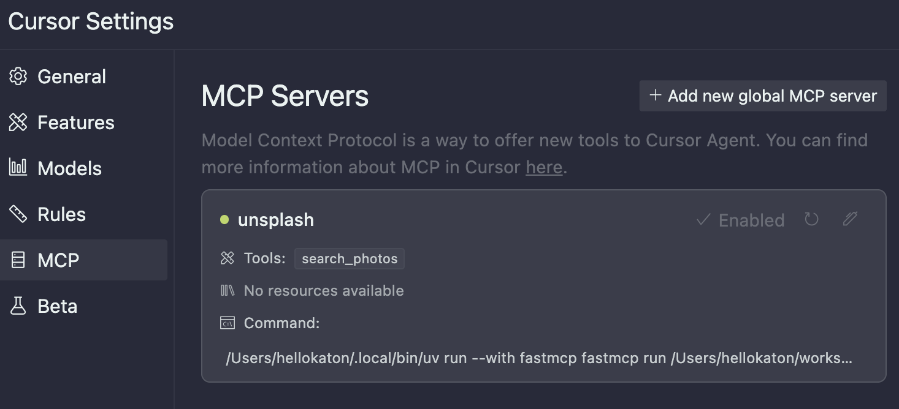
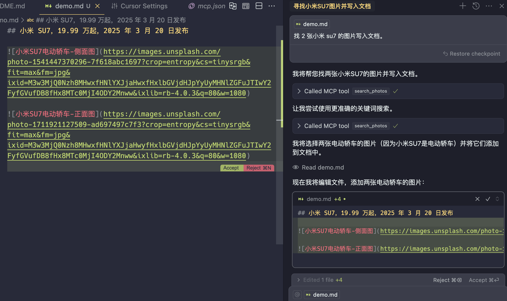

# Unsplash MCP 服务器

[English](README.md) | [中文](README_zh.md)

> 一个简单的 MCP 服务器，用于无缝集成 Unsplash 图片搜索功能。

[](https://www.python.org/downloads/)
[](https://opensource.org/licenses/MIT)
[](https://smithery.ai/server/@hellokaton/unsplash-mcp-server)

## 📋 概述

Unsplash MCP 服务器通过 MCP 提供了一个简单而强大的接口，用于搜索和使用 Unsplash 丰富的高质量图片集合。非常适合希望将 Unsplash 功能集成到自己的应用程序或 Cursor 编辑器工作流程中的开发者。

## ✨ 特性

- **高级图片搜索**：搜索 Unsplash 庞大的图片库，支持以下筛选条件：
  - 关键词相关性
  - 颜色方案
  - 方向选项
  - 自定义排序和分页

## 🔧 前提条件

- Python 3.9 或更高版本
- UV 包管理器 (`pip install uv`)
- Unsplash API 访问密钥 (在 [Unsplash 开发者门户](https://unsplash.com/developers) 注册)

## 🚀 安装

### 通过 Smithery 安装

通过 [Smithery](https://smithery.ai/server/@hellokaton/unsplash-mcp-server) 自动为 Claude Desktop 安装 Unsplash 图片集成服务器：

```bash
npx -y @smithery/cli install @hellokaton/unsplash-mcp-server --client claude
```

### 手动安装

```bash
# 克隆代码库
git clone https://github.com/hellokaton/unsplash-mcp-server.git

# 进入项目目录
cd unsplash-mcp-server

# 创建虚拟环境
uv venv

# 安装依赖
uv pip install .
```

## 💻 使用方法

### 本地开发

1. 在根目录创建一个 `.env` 文件：

```env
UNSPLASH_ACCESS_KEY=你的访问密钥
```

2. 在开发模式下运行服务器：

```bash
fastmcp dev server.py
```

### Cursor 编辑器集成

将以下配置添加到你的 Cursor 编辑器的 `settings.json` 中：

⚠️ **注意：** 请根据你的实际安装情况调整以下配置：

- 如果 `uv` 不在系统 PATH 中，请使用绝对路径（如 `/path/to/uv`）
- `./server.py` 应修改为你的服务器脚本的实际位置（可以使用绝对路径或相对于工作区的路径）



```json
{
  "mcpServers": {
    "unsplash": {
      "command": "uv",
      "args": ["run", "--with", "fastmcp", "fastmcp", "run", "./server.py"],
      "env": {
        "UNSPLASH_ACCESS_KEY": "${YOUR_ACCESS_KEY}"
      }
    }
  }
}
```

### 在 Cursor 中使用



## 🛠️ 可用工具

### 搜索图片

```json
{
  "tool": "search_photos",
  "query": "mountain",
  "per_page": 5,
  "orientation": "landscape"
}
```

## 🔄 替代实现

### Golang 版本

如果你偏好使用 Golang，也有一个 Unsplash MCP 服务器的 Golang 实现版本：

- 代码库：[github.com/douglarek/unsplash-mcp-server](https://github.com/douglarek/unsplash-mcp-server)
- 具有与 Python 版本相同的功能
- 遵循 Golang 最佳实践和标准

#### 安装（Golang 版本）

```bash
# 克隆代码库
git clone https://github.com/douglarek/unsplash-mcp-server.git

# 进入项目目录
cd unsplash-mcp-server

# 安装依赖并构建
go mod tidy
go build
```

## 📄 许可证

[MIT 许可证](LICENSE)

## 📬 联系方式

- [Twitter/X](https://x.com/hellokaton)
- [GitHub Issues](https://github.com/hellokaton/unsplash-mcp-server/issues)
